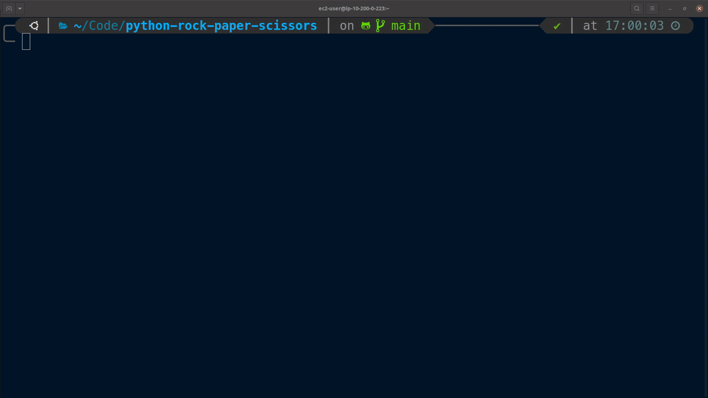

<h1>python-rock-paper-scissors</h1>

This is the classic game of **ROCK**, **PAPER**, **SCISSORS** which I have created from scratch to experiment with the python language.



## Install

### 1. Clone the repository

```bash
git clone https://github.com/micode33/python-rock-paper-scissors.git
```

### 2. Change into the directory

```bash
cd python-rock-paper-scissors
```

### 3. Run the game

```bash
python __main__.py
```

## Usage

```bash
Follow the onscreen instructions and enjoy
```